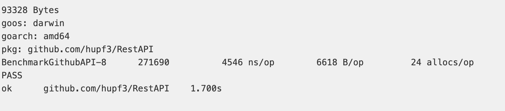
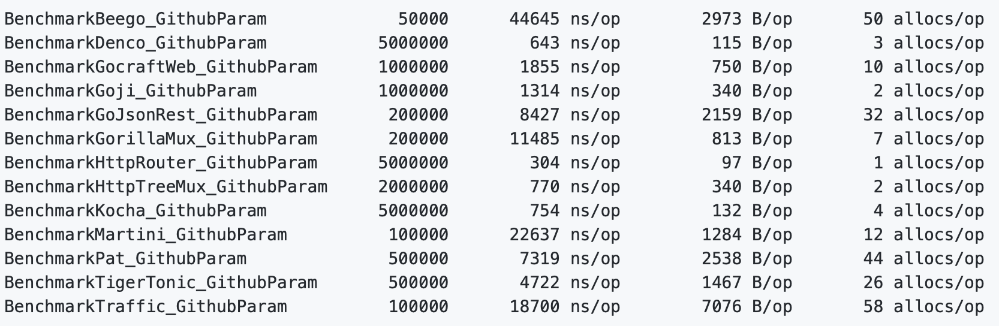

# REST API 高性能路由库设计

## 介绍

本仓库存储了 `go` 实现的 `REST API` 高性能路由库设计

如果您是 `TA`，请移步到 [specification.md](./specification.md) 进行检查，那里有更详细的设计过程

## 实验环境

**操作系统**：`Mac OS`

**编辑器**：`Visual Studio Code`

**go 版本**：`go1.15.2 darwin/amd64`

## 获取程序包

输入以下的命令即可获取我实现的 `myRxgo` 包

```
go get github.com/hupf3/RestAPI
```

或者在 `src` 的相应目录下输入以下命令

```
git clone https://github.com/hupf3/RestAPI.git
go build
go install
```

## 简单说明

该程序包实现了 `http.Handler` 的中间件，并且实现了以下功能：

- 路由参数
- 支持正则表达式匹配
- 根据路由生成地址
- 自定义附加匹配项
- 自动生成请求的内容

使用示例：

```go
m := mux.New(false, false, false, nil, nil).
    Get("/users/1", h).
    Post("/login", h).
    Get("/pages/{id:\\d+}.html", h).
    Get("/posts/{path}.html", h).    
    Options("/users/1", "GET").    

// 前缀统一
p := m.Prefix("/api")
p.Get("/logout", h)
p.Post("/login", h) 

// 相同资源的不同操作
res := p.Resource("/users/{id:\\d+}")
res.Get(h)
res.Post(h)
res.URL(map[string]string{"id": "5"}) 
http.ListenAndServe(":8080", m)
```

正则表达式的匹配：

```go
/posts/{id:\\d+}
/posts/{:\\d+} 
```

路由参数的获取可通过 `Params` 函数：

```go
params := Params(r)

id, err := params.Int("id")
id := params.MustInt("id", 0) 
```

其他的具体用法也可以查看本程序包中的 [API 文档](./API.html)

## 性能比较

下面两张图是我实现的路由器的性能与已存在的路由器的性能的对比，上面的图片是我实现的路由器的测试结果，下面是已存在的路由器的测试结果：

- 

- 

