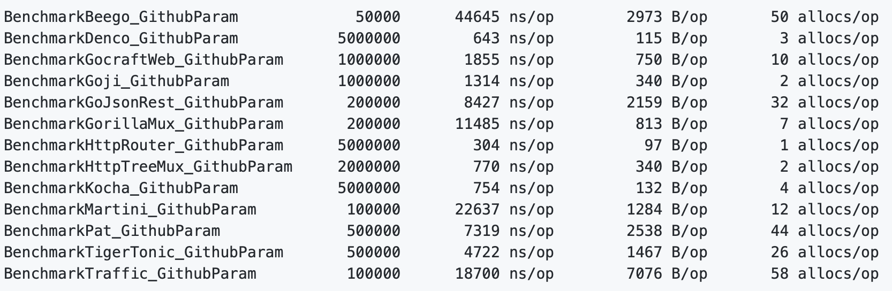

# REST API 高性能路由库设计

## 个人信息

| 课程名称 |  服务计算   |   任课老师   |      潘茂林      |
| :------: | :---------: | :----------: | :--------------: |
|   年级   |   2018级    | 专业（方向） |   软件工程专业   |
|   学号   |  18342025   |     姓名     |      胡鹏飞      |
|   电话   | 13944589695 |    Email     | 945554668@qq.com |

## REST API 介绍

`REST API` 是前后端分离最佳实践，是开发的一套标准或者说是一套规范，不是框架。

- 每一个 `URL` 代表一种资源；
- 客户端和服务器之间，传递这种资源的某种表现层；

- 客户端通过 `GET`、`POST`、`DELETE`、`PUT` 等多个 `HTTP` 请求方法，对服务器端资源进行操作，实现"表现层状态转化"。

## 作业要求

由于本次作业并没有详细的作业要求，根据课程网页以及老师上课所说大致作业要求如下：设计一个专用于 `REST API` 高性能路由库，并且测试 `github` 所有的官方 `API`

## 实验环境

**操作系统**：`Mac OS`

**编辑器**：`Visual Studio Code`

**go 版本**：`go1.15.2 darwin/amd64`

## 博客地址

[传送门](https://blog.csdn.net/qq_43267773/article/details/111406377)

## 设计说明

### 获取程序包

输入以下的命令即可获取我实现的 `myRxgo` 包

```
go get github.com/hupf3/RestAPI
```

或者在 `src` 的相应目录下输入以下命令

```
git clone https://github.com/hupf3/RestAPI.git
go build
go install
```

### 简单说明

该程序包实现了 `http.Handler` 的中间件，并且实现了以下功能：

- 路由参数
- 支持正则表达式匹配
- 根据路由生成地址
- 自定义附加匹配项
- 自动生成请求的内容

使用示例：

```go
m := mux.New(false, false, false, nil, nil).
    Get("/users/1", h).
    Post("/login", h).
    Get("/pages/{id:\\d+}.html", h).
    Get("/posts/{path}.html", h).    
    Options("/users/1", "GET").    

// 前缀统一
p := m.Prefix("/api")
p.Get("/logout", h)
p.Post("/login", h) 

// 相同资源的不同操作
res := p.Resource("/users/{id:\\d+}")
res.Get(h)
res.Post(h)
res.URL(map[string]string{"id": "5"}) 
http.ListenAndServe(":8080", m)
```

正则表达式的匹配：

```go
/posts/{id:\\d+}
/posts/{:\\d+} 
```

路由参数的获取可通过 `Params` 函数：

```go
params := Params(r)

id, err := params.Int("id")
id := params.MustInt("id", 0) 
```

其他的具体用法也可以查看本程序包中的 [API 文档](./API.html)

### 包文件结构

首先通过 `tree` 命令查看包的内容如下：


根据上图分别介绍各个文件以及目录的设计含义：

- `API.html`：根据 `godoc` 命令自动生成的 `API` 文档

- `README.md`：说明文档

- `specification.md`：程序包设计说明文档

- `bench_test.go`：专门为功能测试写的测试文件，主要用来测试所有官方 `Github API`；设计了存储 `API` 的结构体：

  ```go
  type api struct {
  	method    string
  	routeItem string // 路由项
  	test      string // 测试地址
  }
  ```

  设计了存储全部官方 `Github API` 的数组：

  ```go
  var apis = []*api{
  	{method: http.MethodGet, routeItem: "/events"},
  	{method: http.MethodGet, routeItem: "/repos/{owner}/{repo}/events"},
    ...
  }
  ```

- `go.mod/go.sum`：设计的程序包需要依赖的库

- `help`：此目录放置了本次实验项目需要的辅助型函数

  - `handles`：该程序包实现的功能是处理节点下与处理函数之间的关系

    - `handlers.go`：设计了对应于每个请求方法的处理函数；

      ```go
      // 对应于每个请求方法的处理函数
      type Handlers struct {
      	handlers     map[string]http.Handler
      	optionsAllow string       // 报头内容
      	optionsState optionsState // 请求的处理方式
      	headState    headState
      }
      ```

      声明一个新的 `Handler`；

      ```go
      // 声明一个新的 Handler
      func New(disableOptions, disableHead bool) *Handlers {
      }
      ```

      添加一个处理函数；

      ```go
      // 添加一个处理函数
      func (hs *Handlers) Add(h http.Handler, methods ...string) error {
      }
      ```

      判断方法是否存在；

      ```go
      // 方法是否存在
      func methodExists(m string) bool {
      }
      ```

      去除某个请求方法的处理函数；

      ```go
      // 去除某个请求方法的处理函数
      func (hs *Handlers) Remove(methods ...string) bool {
      }
      ```

      获取指定请求方法对应的处理函数；

      ```go
      // 获取指定请求方法对应的处理函数
      func (hs *Handlers) Handler(method string) http.Handler {
      	return hs.handlers[method]
      }
      ```

      获取指定请求方法对应的列表字符串；

      ```go
      // 获取指定请求方法对应的列表字符串
      func (hs *Handlers) Options() string {
      	return hs.optionsAllow
      }
      ```

      获取该节点的请求方法

      ```go
      // 获取该节点的请求方法
      func (hs *Handlers) Methods(ignoreHead, ignoreOptions bool) []string {
      }
      
      ```

    - `methods.go`：存储了每个请求方法的对应值；

      ```go
      // 每个请求方法对应值
      var methodMap = map[string]int{
      	"GET":     1,
      	"POST":    2,
      	"DELETE":  4,
      	"PUT":     8,
      	"PATCH":   16,
      	"CONNECT": 32,
      	"TRACE":   64,
      	"OPTIONS": 128,
      	"HEAD":    256,
      }
      ```

      存储了所有请求方法的全排列：

      ```go
      // 所有请求方法的全排列
      var optionsStrings = []string{
      	"",
      	"GET",
      	"POST",
        ...
      }
      ```

  - `interceptor`：该程序包实现的功能是针对正则表达式拦截处理

    - `interceptor.go`：设计了注册拦截器；

      ```go
      // 对于注册的处理
      func Register(f MatchFunc, val ...string) error {
      }
      ```

      设计了注销拦截器；

      ```go
      // 对于注销的处理
      func Deregister(val ...string) {
      }
      ```

      实现了查找制定的处理函数

      ```go
      // 查找制定的处理函数
      func Get(v string) (MatchFunc, bool) {
      }
      ```

    - `match.go`：该函数实现了正则表达式匹配数字；

      ```go
      // 匹配数字
      func MatchDigit(path string) bool {
      	for _, c := range path {
      		if c < '0' || c > '9' {
      			return false
      		}
      	}
      	return len(path) > 0
      }
      
      ```

      匹配单词；

      ```go
      // 匹配单词
      func MatchWord(path string) bool {
      	for _, c := range path {
      		if (c < '0' || c > '9') && (c < 'a' || c > 'z') && (c < 'A' || c > 'Z') {
      			return false
      		}
      	}
      	return len(path) > 0
      }
      ```

      匹配任意内容

      ```go
      // 匹配任意的非空内容
      func MatchAny(path string) bool { return len(path) > 0 }
      ```

  - `params`：该程序包实现的功能是获取并且转换路由中的参数信息

    - `params.go`：实现了获取参数；

      ```go
      // 获取一个Params
      func Get(r *http.Request) Params {
      }
      ```

      判断指定参数是否存在；

      ```go
      // 查找制定的参数是否存在
      func (p Params) Exists(key string) bool {
      	_, found := p[key]
      	return found
      }
      ```

      将参数转化为任意数据类型的函数如转化为 `int`：

      ```go
      // 将变量转化为int
      func (p Params) Int(key string) (int64, error) {
      	str, found := p[key]
      	if !found {
      		return 0, ErrParamNotExists
      	}
      
      	return strconv.ParseInt(str, 10, 64)
      }
      ```

  - `syntax`：该程序包实现的功能是处理路由的语法

    - `segment.go`：设计了存储路由项被拆分后的内容的结构体；

      ```go
      // 路由项被拆分之后的内容
      type Segment struct {
      	Value string // 数值
      	Type  Type   // 类型
      
      	Endpoint bool // 是否为终点
      
      	Name   string // 参数名称
      	Suffix string // 后缀字符串
      
      	expr *regexp.Regexp // 正则表达式参数
      
      	matcher interceptor.MatchFunc // 处理函数
      }
      ```

      声明一个新的结构体的函数；

      ```go
      // 生命新的Segment结构体
      func NewSegment(val string) *Segment {
      }
      ```

      返回相似度的函数；

      ```go
      // 表示相似度
      func (seg *Segment) Similarity(s1 *Segment) int {
      	if s1.Value == seg.Value {
      		return -1
      	}
      
      	return longestPrefix(s1.Value, seg.Value)
      }
      ```

      拆分；

      ```go
      // 拆分
      func (seg *Segment) Split(pos int) []*Segment {
      	return []*Segment{
      		NewSegment(seg.Value[:pos]),
      		NewSegment(seg.Value[pos:]),
      	}
      }
      ```

      判断路径与当前节点是否匹配

      ```go
      // 路径与当前节点是否匹配
      func (seg *Segment) Match(path string, params params.Params) int {
      }
      ```

    - `state.go`：设计了存储状态的结构体；

      ```go
      // 状态
      type state struct {
      	start     int
      	end       int
      	separator int
      	state     byte
      	err       string // 错误信息
      }
      ```

      创建一个新的状态；

      ```go
      // 创建新的state
      func newState() *state {
      	s := &state{}
      	s.reset()
      
      	return s
      }
      ```

      设置状态；

      ```go
      // 设置状态
      func (s *state) setStart(index int) {
      }
      ```

      重置状态

      ```go
      // 重置
      func (s *state) reset() {
      	s.start = 0
      	s.end = -10
      	s.separator = -10
      	s.state = endByte
      	s.err = ""
      }
      ```

    - `syntax.go`：实现了字符串到字符串数组的转化

      ```go
      // 字符串转化为字符串数组
      func Split(str string) ([]*Segment, error) {
      }
      ```

  - `tree`：该程序包实现的功能是实现了以树形结构保存的路由项对相关操作

    - `debug.go`：专门用来负责调试的；实现了输出树状结构的功能；

      ```go
      // 输出树状结构
      func (tree *Tree) Print(w io.Writer) {
      	tree.print(w, 0)
      }
      
      ```

      实现了获取当前路由下有处理函数的节点的数量

      ```go
      // 获取当前节点数量
      func (n *node) len() int {
      }
      ```

    - `node.go`：设计了路由中的节点的结构体；

      ```go
      // 路由中的节点
      type node struct {
      	parent   *node
      	handlers *handlers.Handlers
      	children []*node
      	segment  *syntax.Segment
      
      	indexes map[byte]int
      }
      ```

      构建了索引表；

      ```go
      // 构建索引表
      func (n *node) buildIndexes() {
      }
      ```

      返回优先级；

      ```go
      // 返回优先级
      func (n *node) priority() int {
      }
      ```

      获取指定路径下的节点；

      ```go
      // 获取指定路径下的节点
      func (n *node) getNode(segments []*syntax.Segment) *node {
      }
      ```

      生成新的子节点；

      ```go
      // 产生新的子节点
      func (n *node) newChild(s *syntax.Segment) *node {
      }
      ```

      查找路由项:

      ```go
      // 查找路由项
      func (n *node) find(pattern string) *node {
      }
      ```

    - `tree.go`：设计了树的形式存储路由：

      ```go
      // 树的形式存储路由
      type Tree struct {
      	node
      	disableOptions bool
      	disableHead    bool
      }
      ```

      声明了一个新的树：

      ```go
      // 声明一个新的树
      func New(disableOptions, disableHead bool) *Tree {
      }
      ```

      添加路由项：

      ```go
      // 添加路由项
      func (tree *Tree) Add(pattern string, h http.Handler, methods ...string) error {
      	...
      }
      ```

      移除路由项：

      ```go
      // 移除路由项
      func (tree *Tree) Remove(pattern string, methods ...string) {
      }
      ```

      获取指定的节点：

      ```go
      // 获取指定的节点
      func (tree *Tree) getNode(pattern string) (*node, error) {
      }
      ```

      获取所有的路由项：

      ```go
      // 获取所有的路由项
      func (tree *Tree) All(ignoreHead, ignoreOptions bool) map[string][]string {
      	routes := make(map[string][]string, 100)
      	tree.all(ignoreHead, ignoreOptions, "", routes)
      	return routes
      }
      ```

      清除路由项：

      ```go
      // 清除路由项
      func (tree *Tree) Clean(prefix string) {
      	tree.clean(prefix)
      }
      ```

- `img`：此目录存储了实验报告需要的图片文件

- `match.go`：设计了一个验证请求是否符合要求的接口；

  ```go
  // 验证请求是否符合要求
  type Matcher interface {
  	Match(*http.Request) bool
  }
  ```

  定义了限定域名的匹配的工具；

  ```go
  // 域名匹配
  type Hosts struct {
  	domains   []string // 域名
  	wildcards []string // 泛域名
  }
  ```

  可以实现添加子路由组；

  ```go
  // 添加子路由组
  func (mux *Mux) NewMux(name string, matcher Matcher) (*Mux, bool) {
  ...
  }
  ```

  实现了可以添加新的域名；

  ```go
  // 添加新的域名
  func (hs *Hosts) Add(domain ...string) {
  ...
  }
  ```

  实现了删除域名的操作

  ```go
  // 删除域名
  func (hs *Hosts) Delete(domain string) {
  ...
  }
  ```

- `mux.go`：定义了一个路由的结构体；

  ```go
  // 返回参数
  type Router struct {
  	Name   string
  	Routes map[string][]string
  }
  ```

  定义了一个返回参数的结构体；

  ```go
  // 路由匹配
  type Mux struct {
  	name             string     // 路由名称
  	routers          []*Mux     // 子路由
  	matcher          Matcher    // 路由匹配条件
  	tree             *tree.Tree // 路由项
  	notFound         http.HandlerFunc
  	methodNotAllowed http.HandlerFunc
  
  	disableOptions, disableHead, skipCleanPath bool
  
  	names   map[string]string // 路由项和名称对应关系
  	namesMu sync.RWMutex
  }
  ```

  声明一个新的 `Mux` ; 

  ```go
  // 声明一个新的Mux
  func New(disableOptions, disableHead, skipCleanPath bool, notFound, methodNotAllowed http.HandlerFunc) *Mux {
  ...
  }
  ```

  清除所有路由项；

  ```go
  // 清除路由项
  func (mux *Mux) Clean() *Mux {
  ...
  }
  ```

  返回所有路由项；

  ```go
  // 返回所有路由项
  func (mux *Mux) All(ignoreHead, ignoreOptions bool) []*Router {
  ...
  }
  ```

  移除指定的路由项；

  ```go
  // 移除指定路由
  func (mux *Mux) Remove(pattern string, methods ...string) *Mux {
  	mux.tree.Remove(pattern, methods...)
  	return mux
  }
  ```

  添加一条路由数据；

  ```go
  // 添加一个新的路由
  func (mux *Mux) Handle(pattern string, h http.Handler, methods ...string) error {
  	return mux.tree.Add(pattern, h, methods...)
  }
  ```

  并且定义了多参数函数的简写形式方便调用起来方便

- `prefix.go`：定义了统一前缀的结构体：

  ```go
  // 将前缀一样的路由项统一起来
  type Prefix struct {
  	mux    *Mux
  	prefix string
  }
  ```

  将具有统一前缀的路由项都集中在了一起，设计了方便的函数调用，方便后续的操作

- `resource.go`：定义可资源地址的路由配置的结构体：

  ```go
  // 资源地址的路由配置
  type Resource struct {
  	mux     *Mux
  	pattern string
  }
  ```

  将以资源地址为对象的路由配置都集中在了一起，设计了方便的函数调用，方便后续的操作

## 单元测试

我对所有的代码文件都写了配套的测试文件，方便后期进行调试，下面就逐个文件目录进行展示测试结果：

测试的命令如下：

`go test -v 被测试文件 所需要的依赖文件`

`handlers`：


`methods_test`：


`interceptor_test`：


`match_test`：


`params_test`：


`segment_test`：


`syntax_test`：


`node_test`：


`tree_test`：


`match_test`：


`mux_test`：


`prefix_test`：


`resource_test`：


## 功能测试

由于本次实验主要的目的就是设计一个高性能路由库，测试对于所有 `Github` 官方 `API` 的访问情况，我在 [bench_test.go](./bench_test.go) 文件中定义了一个结构体 `apis`，里面存储了所有官方 `Github API`，分别定义了每个 `API` 的请求方法以及地址，如下：

 ```go
// 测试GITHUB官方API
var apis = []*api{
	{method: http.MethodGet, routeItem: "/events"},
	{method: http.MethodGet, routeItem: "/repos/{owner}/{repo}/events"},
	{method: http.MethodGet, routeItem: "/networks/{owner}/{repo}/events"},
  ...
  ...
  {method: http.MethodPost, routeItem: "/repos/{owner}/{repo}/branches/{branch}/protection/restrictions/users"},
	{method: http.MethodDelete, routeItem: "/repos/{owner}/{repo}/branches/{branch}/protection/restrictions/users"},
}
 ```

通过循环访问每一个 `API` 来测试路由库设计的性能，测试的结果如下所示：


已经成功通过测试可以正常进行访问 `API`

性能的比较是通过老师在课程网页上推荐的一个关于现有的路由库访问的性能测试网站：[传送门](https://github.com/julienschmidt/go-http-routing-benchmark)，找到其中关于 `Github API` 的测试结果，我直接将网站中的结果放在下面：



由上面的对比可知我实现的路由库性能相对较好，且功能完善

## API 文档

生成网页版的 API 文档，输入以下的命令：

```
godoc -http=:8080
```

然后在浏览器中打开 [http://127.0.0.1:8080](http://127.0.0.1:8080/) ，即可访问网页版的 `go doc`：


在目录结构下执行以下命令，即可生成线下的 `html` 文件

```
go doc
godoc -url="pkg/github.com/hupf3/RestAPI" > API.html
```

我将该文档也保存在了 `github` 仓库中方便检查

## 实验总结

通过本次学习学到了路由库设计的方法了；也能够更加清楚 `Rest API` 的设计的风格，以及设计的好处；`go` 中关于 `http` 库等许多重要的库函数有了更深的理解并能够应用到设计程序包中；学会了如何生成一份`go.mod` 文件，并且将依赖文件放入其中。 

