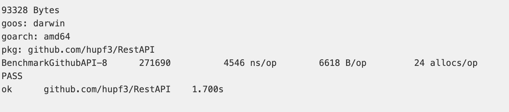

# REST API 高性能路由库设计

## 个人信息

| 课程名称 |  服务计算   |   任课老师   |      潘茂林      |
| :------: | :---------: | :----------: | :--------------: |
|   年级   |   2018级    | 专业（方向） |   软件工程专业   |
|   学号   |  18342025   |     姓名     |      胡鹏飞      |
|   电话   | 13944589695 |    Email     | 945554668@qq.com |

## REST API 介绍

`REST API` 是前后端分离最佳实践，是开发的一套标准或者说是一套规范，不是框架。

- 每一个 `URL` 代表一种资源；
- 客户端和服务器之间，传递这种资源的某种表现层；

- 客户端通过 `GET`、`POST`、`DELETE`、`PUT` 等多个 `HTTP` 请求方法，对服务器端资源进行操作，实现"表现层状态转化"。

## 作业要求

由于本次作业并没有详细的作业要求，根据课程网页以及老师上课所说大致作业要求如下：设计一个专用于 `REST API` 高性能路由库，并且测试 `github` 所有的官方 `API`

## 实验环境

**操作系统**：`Mac OS`

**编辑器**：`Visual Studio Code`

## 博客地址

[传送门](https://blog.csdn.net/qq_43267773/article/details/111406377)

## 设计说明

### 获取包

输入以下的命令即可获取我实现的 `myRxgo` 包

```
go get github.com/hupf3/RestAPI
```

或者在 `src` 的相应目录下输入以下命令

```
git clone https://github.com/hupf3/RestAPI.git
go build
go install
```

### 包文件结构

首先通过 `tree` 命令查看包的内容如下：


根据上图分别介绍各个文件以及目录的设计含义：


## 单元测试

我对所有的代码文件都写了配套的测试文件，方便后期进行调试，下面就逐个文件目录进行展示测试结果：

测试的命令如下：

`go test -v 被测试文件 所需要的依赖文件`

`handlers`：


`methods_test`：


`interceptor_test`：


`match_test`：


`params_test`：


`segment_test`：


`syntax_test`：


`node_test`：


`tree_test`：


`match_test`：


`mux_test`：


`prefix_test`：


`resource_test`：


## 功能测试

由于本次实验主要的目的就是设计一个高性能路由库，测试对于所有 `Github` 官方 `API` 的访问情况，我在 [bench_test.go](./bench_test.go) 文件中定义了一个结构体 `apis`，里面存储了所有官方 `Github API`，分别定义了每个 `API` 的请求方法以及地址，如下：

 ```go
// 测试GITHUB官方API
var apis = []*api{
	{method: http.MethodGet, routeItem: "/events"},
	{method: http.MethodGet, routeItem: "/repos/{owner}/{repo}/events"},
	{method: http.MethodGet, routeItem: "/networks/{owner}/{repo}/events"},
  ...
  ...
  {method: http.MethodPost, routeItem: "/repos/{owner}/{repo}/branches/{branch}/protection/restrictions/users"},
	{method: http.MethodDelete, routeItem: "/repos/{owner}/{repo}/branches/{branch}/protection/restrictions/users"},
}
 ```

通过循环访问每一个 `API` 来测试路由库设计的性能，测试的结果如下所示：



已经成功通过测试可以正常进行访问 `API`

性能的比较是通过老师在课程网页上推荐的一个关于现有的路由库访问的性能测试网站：[传送门](https://github.com/julienschmidt/go-http-routing-benchmark)，找到其中关于 `Github API` 的测试结果，我直接将网站中的结果放在下面：


由上面的对比可知我实现的路由库性能相对较好，且功能完善

## API 文档

生成网页版的 API 文档，输入以下的命令：

```
godoc -http=:8080
```

然后在浏览器中打开 [http://127.0.0.1:8080](http://127.0.0.1:8080/) ，即可访问网页版的 `go doc`：


在目录结构下执行以下命令，即可生成线下的 `html` 文件

```
go doc
godoc -url="pkg/github.com/hupf3/RestAPI" > API.html
```

我将该文档也保存在了 `github` 仓库中方便检查

## 实验总结

